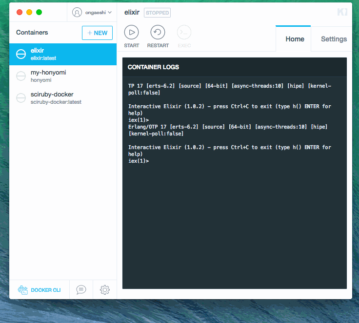
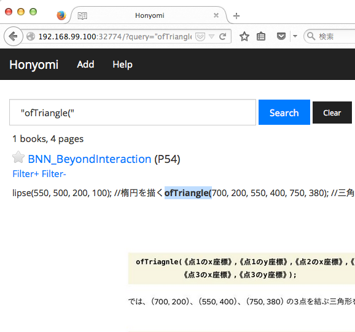

# Honyomi


Honyomi is ebook (pdf) search engine written by Ruby. It have command line interface and web application. It will accelerate the ebook of your life.

Honyomi is "本読み". "Read a book" is meaning. [Milkode](https://github.com/ongaeshi/milkode) are brothers.

- English manual is here
- [日本語](http://honyomi.nagoya/ja/)



## Installation

You can use the Docker container.

- [ongaeshi/honyomi Repository | Docker Hub Registry](https://registry.hub.docker.com/u/ongaeshi/honyomi/)

or

    $ gem install honyomi

When you faild to install Rroonga, Please refer.
* [File: install — rroonga - Ranguba](http://ranguba.org/rroonga/en/file.install.html)

And need external tools.
* pdftotext - For reading pdf (poppler, xpdf)

## Install to server
* [ongaeshi/honyomi-web](https://github.com/ongaeshi/honyomi-web)

## Usage

### Create a database

```
$ honyomi init
Create database to "/home/username/.honyomi/db/honyomi.db"
```

Specify database dir. (Commands as well as other)

```
$ HONYOMI_DATABASE_DIR=/path/to/dir honyomi init
Create database to "/path/to/dir/db/honyomi.db"
```

### Add book

```
$ honyomi add /path/to/this_is_book.pdf
A 1 this_is_book (10 pages)
```

### Add book's image

You can be inline display of the page on the browser.

Need `pdftoppm` command.

```
$ honyomi image 1
Generated images to '/Users/ongaeshi/.honyomi/image/1'
```

### Edit book

Change title. Specify book id.

```
$ honyomi edit 1 -t "This is Book"
id:        1
title:     This is Book
path:      /path/to/this_is_book.pdf
pages:     10
timestamp: 2013-01-01 00:00:00
```

### List books

```
$ honyomi list
1 This is Book (10 pages)
2 That is Book (20 pages)
```

Show detail. Specify book id.

```
$ honyomi list 1
id:        1
title:     This is Book
path:      /path/to/this_is_book.pdf
pages:     10
timestamp: 2013-01-01 00:00:00
```

### Search command line

```
$ honyomi search bbb
1 matches
--- This is Book (5 page) ---
aaa <<bbb>> ccc
```

### Web application

```
$ honyomi web
```



### Basic authorization

1. Get the SHA-2 Hash

```
$ ruby -r 'digest/sha2' -e 'puts Digest::SHA256.hexdigest("this_is_password")'
a6a27374ec8f49426e8ee6249125369e8c529f361ffa20ace73de0b92514bb0f
```

2. It pass to the environment variable

```
$ HONYOMI_AUTH_USERNAME=ongaeshi HONYOMI_AUTH_PASSWORD=a6a27374ec8f49426e8ee6249125369e8c529f361ffa20ace73de0b92514bb0f honyomi web
```


